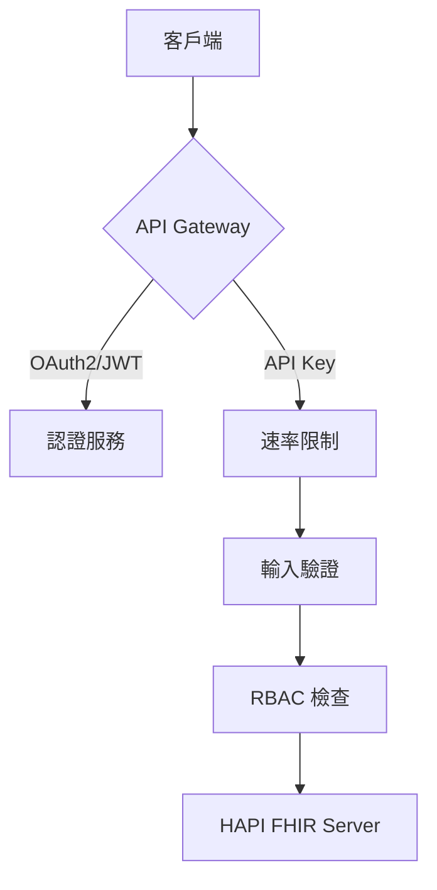
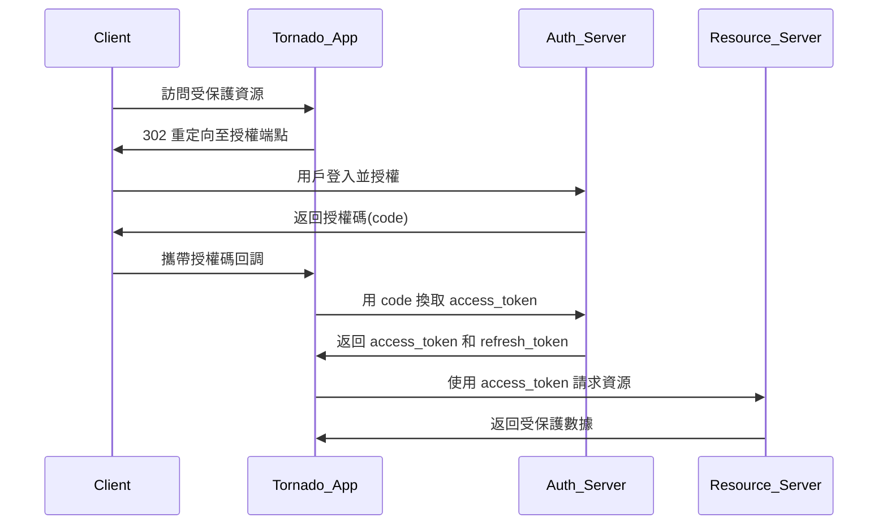

以下是在 Tornado 中擴展 FHIR 搜尋功能並強化端點安全機制的實現方案，分為「FHIR 搜尋功能」和「安全機制強化」兩部分：

---

## 一、FHIR 搜尋功能實現
### 1. 新增 SearchHandler 類別
```python
class SearchHandler(tornado.web.RequestHandler):
    async def get(self):
        # 解析 FHIR 標準搜索參數
        params = {
            "patient": self.get_argument("patient", default=None),
            "date": self.get_argument("date", default=None),
            "_count": self.get_argument("_count", default=10),
            "_format": self.get_argument("_format", default="json")
        }
        
        # 構建 HAPI FHIR 搜索請求
        fhir_search_url = "http://your-hapi-fhir-server/Observation"
        try:
            response = await self.application.http_client.fetch(
                f"{fhir_search_url}?{urllib.parse.urlencode(params)}",
                headers={"Authorization": f"Bearer {self.current_user}"}
            )
            self.write(json.loads(response.body))
        except tornado.httpclient.HTTPError as e:
            self.set_status(e.code)
            self.write({"error": "FHIR server search failed"})
```

### 2. 支援的 FHIR 查詢參數
| 參數        | 類型     | 說明                                                                 |
|-------------|----------|---------------------------------------------------------------------|
| `patient`   | String   | 患者ID (e.g. `Patient/123`)                                         |
| `category`  | Token    | 資源分類 (e.g. `laboratory`)                                        |
| `code`      | Token    | LOINC 代碼 (e.g. `http://loinc.org|29463-7`)                        |
| `date`      | Date     | 時間範圍 (e.g. `ge2025-03-01&le2025-03-08`)                         |
| `_count`    | Number   | 返回結果數量 (最大值由伺服器配置決定)                                |

---

## 二、端點安全強化機制
### 1. 安全架構分層


### 2. 核心安全實現
#### (1) OAuth2 令牌驗證中間件
```python
class AuthMiddleware(object):
    def __init__(self, fhir_auth_url):
        self.fhir_auth_url = fhir_auth_url

    async def validate_token(self, token):
        try:
            response = await http_client.fetch(
                self.fhir_auth_url,
                method="POST",
                headers={"Authorization": f"Bearer {token}"}
            )
            return response.code == 200
        except:
            return False
```

#### (2) JWT 驗證模組
```python
def decode_jwt(token):
    try:
        payload = jwt.decode(
            token,
            settings.JWT_SECRET_KEY,
            algorithms=["HS256"],
            options={"verify_exp": True}
        )
        return payload
    except jwt.ExpiredSignatureError:
        raise tornado.web.HTTPError(401, "Token expired")
    except jwt.InvalidTokenError:
        raise tornado.web.HTTPError(401, "Invalid token")
```

### 3. 安全配置建議
```python
# 在 Application 初始化時配置
def make_app():
    settings = {
        "cookie_secret": "__SECURE_RANDOM_KEY__",
        "xsrf_cookies": True,
        "security_headers": {
            "Content-Security-Policy": "default-src 'self'",
            "Strict-Transport-Security": "max-age=31536000; includeSubDomains"
        }
    }
    
    return tornado.web.Application([
        (r"/search", SearchHandler),
    ], **settings)
```

---

## 三、整合實現代碼
### 1. 路由配置
```python
def make_app():
    return tornado.web.Application([
        (r"/", MainHandler),
        (r"/auth", AuthHandler),
        (r"/fhir/search", SearchHandler),  # 受保護端點
    ], autoreload=False)  # 生產環境需禁用自動重載
```

### 2. 請求處理流程
```
1. 客戶端請求 -> 
2. 檢查 Authorization Header ->
3. 令牌驗證 (OAuth2/JWT/API Key) ->
4. 速率限制檢查 ->
5. 輸入參數過濾 ->
6. RBAC 權限驗證 ->
7. 代理請求至 HAPI FHIR ->
8. 審計日誌記錄
```

---

## 四、進階安全建議
1. **HSTS 強制加密**  
   ```nginx
   # 在反向代理層配置
   add_header Strict-Transport-Security "max-age=63072000; includeSubDomains; preload";
   ```

2. **動態速率限制**  
   ```python
   from tornado.web import RequestHandler
   from slowapi import Limiter
   from slowapi.util import get_remote_address

   limiter = Limiter(key_func=get_remote_address)

   class LimitedHandler(RequestHandler):
       @limiter.limit("100/minute")
       async def get(self):
           self.write("Rate limited endpoint")
   ```

3. **FHIR 查詢注入防護**  
   ```python
   SAFE_CHARS = set("abcdefghijklmnopqrstuvwxyzABCDEFGHIJKLMNOPQRSTUVWXYZ0123456789-._:/=")

   def sanitize_fhir_param(param):
       return ''.join(c for c in param if c in SAFE_CHARS)
   ```

---

## 五、測試驗證腳本範例
```bash
# 權杖獲取測試
curl -X POST http://localhost:8888/auth \
  -d "username=clinician&password=SecurePass123!"

# 搜尋端點測試 (需替換 YOUR_TOKEN)
curl -X GET "http://localhost:8888/fhir/search?patient=123&date=ge2025-03-01" \
  -H "Authorization: Bearer YOUR_TOKEN"
```

---

## 六、注意事項
1. 需根據實際 HAPI FHIR 服務器的 OAuth2 配置調整 `client_id` 和 `client_secret`
2. 敏感配置（如 JWT 密鑰）應通過環境變量注入
3. 建議實施多層次防禦：
   - 網絡層：防火牆規則限制 FHIR 服務器訪問
   - 應用層：WAF (Web Application Firewall)
   - 數據層：字段級加密 (Field-Level Encryption)


以下是在 Tornado 框架中實現 OAuth2 認證機制的完整方案，包含 **客戶端流程** 和 **服務端實現** 兩大部分：

---

## 一、OAuth2 核心概念圖解


---

## 二、Tornado 作為 OAuth2 客戶端實現

### 1. 配置 OAuth2 參數
```python
OAUTH_CONFIG = {
    "client_id": "your_client_id",
    "client_secret": "your_client_secret",
    "authorize_url": "https://auth-server/oauth2/authorize",
    "token_url": "https://auth-server/oauth2/token",
    "redirect_uri": "http://your-tornado-app:8888/oauth/callback",
    "scopes": "patient/*.read observation/*.read"  # FHIR 資源訪問範圍
}
```

### 2. 核心 Handler 實現
#### (1) 授權請求處理
```python
class OAuth2AuthHandler(tornado.web.RequestHandler):
    async def get(self):
        # 構建授權請求 URL
        params = {
            "response_type": "code",
            "client_id": OAUTH_CONFIG["client_id"],
            "redirect_uri": OAUTH_CONFIG["redirect_uri"],
            "scope": OAUTH_CONFIG["scopes"],
            "state": hashlib.sha256(os.urandom(1024)).hexdigest()  # CSRF 防護
        }
        self.redirect(f"{OAUTH_CONFIG['authorize_url']}?{urllib.parse.urlencode(params)}")
```

#### (2) 回調處理與令牌獲取
```python
class OAuth2CallbackHandler(tornado.web.RequestHandler):
    async def get(self):
        auth_code = self.get_argument("code")
        state = self.get_argument("state")

        # 驗證 state 參數
        if not validate_state(state):
            raise tornado.web.HTTPError(400, "Invalid state parameter")

        # 獲取 access_token
        token_data = {
            "grant_type": "authorization_code",
            "code": auth_code,
            "redirect_uri": OAUTH_CONFIG["redirect_uri"],
            "client_id": OAUTH_CONFIG["client_id"],
            "client_secret": OAUTH_CONFIG["client_secret"]
        }

        try:
            response = await self.application.http_client.fetch(
                OAUTH_CONFIG["token_url"],
                method="POST",
                body=urllib.parse.urlencode(token_data),
                headers={"Content-Type": "application/x-www-form-urlencoded"}
            )
            tokens = json.loads(response.body)
            self.set_secure_cookie("access_token", tokens["access_token"])
            self.redirect("/protected-resource")
        except tornado.httpclient.HTTPError as e:
            self.write(f"Token exchange failed: {e}")
```

---

## 三、Tornado 作為 OAuth2 服務端實現

### 1. 數據庫模型設計
```python
class OAuth2Client(tornado.queues.Queue):
    # SQLAlchemy 模型示例
    __tablename__ = 'oauth_clients'
    client_id = Column(String(48), primary_key=True)
    client_secret = Column(String(120))
    grant_types = Column(JSON)
    redirect_uris = Column(JSON)
    default_scopes = Column(JSON)
```

### 2. 令牌簽發端點
```python
class TokenHandler(tornado.web.RequestHandler):
    async def post(self):
        grant_type = self.get_argument("grant_type")
        client_id = self.get_argument("client_id")
        client_secret = self.get_argument("client_secret")

        # 驗證客戶端憑證
        client = await validate_client(client_id, client_secret)
        
        if grant_type == "authorization_code":
            code = self.get_argument("code")
            # 驗證授權碼並簽發令牌
            access_token = generate_jwt_token(client, scopes=["read"])
            self.write({
                "access_token": access_token,
                "token_type": "Bearer",
                "expires_in": 3600
            })
```

---

## 四、安全強化措施

### 1. JWT 令牌簽發與驗證
```python
def generate_jwt_token(client, scopes):
    payload = {
        "iss": "https://your-auth-server",
        "sub": client.client_id,
        "aud": "https://hapi-fhir-server",
        "exp": datetime.utcnow() + timedelta(hours=1),
        "scopes": scopes
    }
    return jwt.encode(payload, OAUTH_CONFIG['jwt_secret'], algorithm="HS256")

async def verify_jwt_token(handler):
    token = handler.get_secure_cookie("access_token").decode()
    try:
        payload = jwt.decode(
            token, 
            OAUTH_CONFIG['jwt_secret'],
            audience="https://hapi-fhir-server",
            algorithms=["HS256"]
        )
        handler.current_user = payload
    except jwt.ExpiredSignatureError:
        handler.redirect("/refresh-token")
```

### 2. 速率限制配置
```python
from tornado.web import RequestHandler
from slowapi import Limiter
from slowapi.util import get_remote_address

limiter = Limiter(key_func=get_remote_address)

class RateLimitedHandler(RequestHandler):
    @limiter.limit("100/hour")
    async def post(self):
        self.write("Rate limited endpoint")
```

---

## 五、整合 FHIR 資源訪問
```python
class FHIRResourceHandler(tornado.web.RequestHandler):
    async def prepare(self):
        # 驗證訪問令牌
        if not self.current_user:
            self.redirect("/oauth/login")
            return

    async def get(self, resource_type):
        # 代理請求到 HAPI FHIR 服務器
        headers = {
            "Authorization": f"Bearer {self.get_secure_cookie('access_token').decode()}",
            "Accept": "application/fhir+json"
        }
        
        try:
            response = await self.application.http_client.fetch(
                f"https://hapi-fhir-server/{resource_type}",
                headers=headers
            )
            self.write(response.body)
        except tornado.httpclient.HTTPError as e:
            self.set_status(e.code)
            self.write({"error": str(e)})
```

---

## 六、測試流程與指令

### 1. 完整 OAuth2 流程測試
```bash
# 觸發授權流程
curl -v http://localhost:8888/oauth/login

# 令牌刷新示例
curl -X POST http://localhost:8888/oauth/token \
  -d "grant_type=refresh_token&refresh_token=YOUR_TOKEN"

# 受保護資源訪問
curl -H "Authorization: Bearer YOUR_ACCESS_TOKEN" \
  http://localhost:8888/fhir/Patient
```

---

## 七、高級安全實踐建議

1. **動態客戶端註冊**  
   ```python
   class DynamicClientRegistration(tornado.web.RequestHandler):
       async def post(self):
           metadata = json.loads(self.request.body)
           if validate_metadata(metadata):
               client_id = generate_client_id()
               client_secret = secrets.token_urlsafe(32)
               await store_client_credentials(client_id, client_secret)
               self.write({"client_id": client_id, "client_secret": client_secret})
   ```

2. **令牌撤銷端點**  
   ```python
   class TokenRevocationHandler(tornado.web.RequestHandler):
       async def post(self):
           token = self.get_argument("token")
           await revoke_token(token)  # 更新數據庫或分佈式黑名單
           self.write({"status": "revoked"})
   ```

3. **審計日誌集成**  
   ```python
   class AuditLogMiddleware:
       def __init__(self, app):
           self.app = app

       def __call__(self, request):
           log_data = {
               "timestamp": datetime.utcnow(),
               "client_ip": request.remote_ip,
               "endpoint": request.uri,
               "user": getattr(request, 'current_user', None)
           }
           self.app.settings['audit_logger'].log(log_data)
           return self.app(request)
   ```

---

## 八、部署注意事項

1. **HTTPS 強制啟用**  
   在 `Application` 配置中添加：
   ```python
   settings = {
       "xsrf_cookies": True,
       "secure_cookies": True,
       "ssl_options": {
           "certfile": "/path/to/cert.pem",
           "keyfile": "/path/to/key.pem"
       }
   }
   ```

2. **密鑰管理最佳實踐**  
   ```python
   # 從環境變量獲取敏感信息
   OAUTH_CONFIG['client_secret'] = os.environ.get('OAUTH_CLIENT_SECRET')
   OAUTH_CONFIG['jwt_secret'] = os.environ.get('JWT_SECRET_KEY')
   ```

3. **災難恢復方案**  
   - 定期輪換 JWT 簽名密鑰
   - 實現多區域令牌驗證副本
   - 準備緊急撤銷所有令牌的「核按鈕」機制

---

以上實現方案完整涵蓋了 OAuth2 在 Tornado 中的典型應用場景，可根據實際需求調整授權流程類型和安全級別配置。

